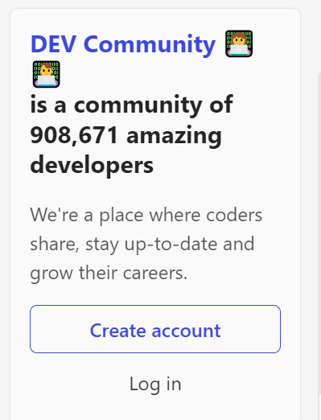
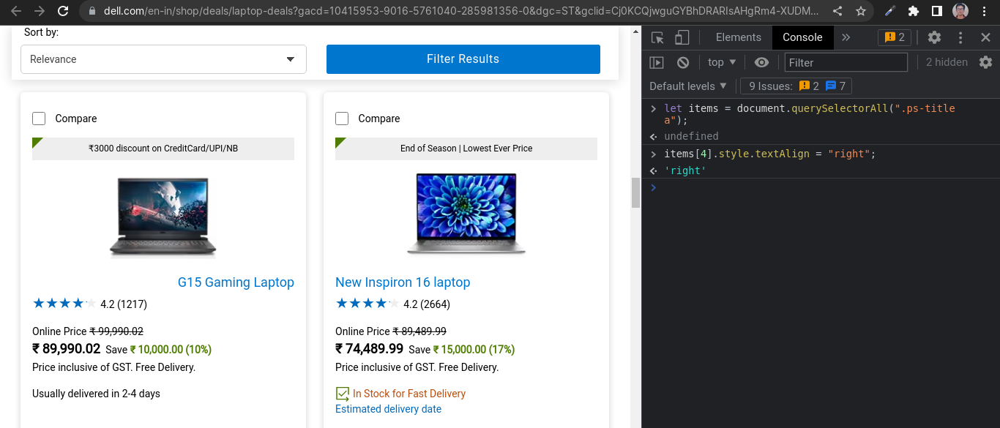

# Dom Manipulation Assignment

## 1. Webiste Name: [Dev To](https://dev.to/)

### Topics

    - Query Selctory, Inner HTML

### Sample Image



### Tasks

> Target the Top description div and change the DEV Community to <Your_Name> and description to your passion

<br/>

### Solution
```js
- document.querySelector(".side-bar .crayons-card .crayons-subtitle-2").innerHTML = "Navneet Kumar";

- document.querySelector(".side-bar .crayons-card p").innerHTML = "I'm a passionate frontend developer.";
```
### My Output


<br>
<br>

## 2. Website Name: [Apple](https://support.apple.com/en-in)

### Task


> Fetch all the product name and store in an array

### Solution
```js
const arr = [];
document.querySelectorAll(".as-imagegrid-item-title").forEach((item) => {
  arr.push(item.innerText.replace("\nSupport", ""));
});
console.log(arr);
```

### My Output

['iPhone', 'Mac', 'iPad', 'Watch', 'AirPods', 'Music', 'TV']

<br>

## 3. Webiste Name: [Youtube Support](https://support.google.com/youtube/)

### Topic

    - Get Element By Id, Create Element, Create Text Node, Append Child

### Sample Image


### Task

> Add another FAQ 'My New FAQ' to the list

<br>

### Solution
```js
- let section = document.createElement("section");
- section.classList.add("parent");
- let newFaq = document.createElement("h3");
- newFaq.innerText = "My New FAQ";
- section.appendChild(newFaq);
- document.querySelector(".accordion-homepage").appendChild(section);
```

### My Output


<br>

## 4. Webiste Name: [OnePlus](https://www.oneplus.in/support)

### Topic

     Query Selector, InnerText

### Sample Image


### Tasks

> Change the contact number

<br>

### Solution
```js
- document.querySelector(".oneplus-footer--contact div ul li a span").innerText = "Contact Us +9163325992437";
```
### My Output


<br>

## 5. Webiste Name: [Samsung](https://www.samsung.com/in/offer/online/samsung-fest/)

### Topics

       getElementById, createElement, InnerText, append, setAttribute

### Sample Image


### Tasks

     Target the main div of card and change the Button text to Check out

<br>

### Solution
```js
- let items = document.querySelectorAll(".featureddealscombo .container .tab-content #smartphone-deals .listing .diwali-deals-product-sale-pro-outer");
- items[0].setAttribute("id", "domjs");
- document.querySelector("#domjs div .diwali-deals-product-sale-btn").innerText = "Check Out";
```

### My Output


<br>

## 6. Webiste Name: [Adidas](https://www.adidas.co.in/)

### Topics

    -   Query Selector, Event listeners, Changing Styles

### Sample Image


### Tasks

> Target the search box and on hover change thebackground color to red.

<br>

### Solution
```js
- let input = document.querySelector(".searchinput___19uW0");
- input.addEventListener("mouseover", bgRed => { input.style.backgroundColor = "red";});
- input.addEventListener("mouseout", transParent => {input.style.backgroundColor = "transparent";});
```

### My Output


## 7. Webiste Name: [MDN Web Docs](https://developer.mozilla.org/en-US/)

### Topics

       Form, Value, Submit

### Sample Image


### Tasks
> To Search a topic in the MDN Search bar. First add a text to search in the search bar and then hit the submit search button to search the docs using DOM

<br>

### Solution
```js
- document.querySelector("#top-nav-search-input").value = "javascript";
- document.querySelector("#top-nav-search-form").submit();
```

### My Output


<br>

## 8. Webiste Name: [Google](https://www.google.com/)

### Topics

       Remove Elements

### Sample Image


### Tasks

> Remove alternate languages from the home page languages listed

<br>

### Solution
```js
let items = document.querySelectorAll("#SIvCob a");
for (i=0; i<items.length; i+=2) { items[i].remove()};
```

### My Output


<br>

## 9. Webiste Name: [Code Wars](https://www.codewars.com/)

### Topics

       Change Font Family, Color of Text.

### Sample Image


### Tasks

> Change the font family of the text to monospace and text color to the logo’s background color.

<br>

### Solution
```js
- document.querySelector(".text-color-white").style.fontFamily = "monospace";
- document.querySelector(".text-color-white").style.color = "red";
- document.querySelector(".text-color-hero-gradient").style.webkitTextFillColor = "red";
```

### My Output


## 10. Webiste Name: [Freecodecamp](https://www.freecodecamp.org/)

### Topics

       querySelector, mouseover, click eventListener,  callback function, style,

### Sample Image


### Tasks

> Target the button and change background colour on mouseover

<br>

### Solution
```js
- let bTn = document.querySelector(".btn-cta-big .login-btn-text"); 
- bTn.addEventListener("mouseover", red => { bTn.style.background = "red"});
- bTn.addEventListener("mouseout", clear => { bTn.style.background = "transparent"});
```

### My Output


<br>

## 11. Webiste Name: [realme](https://www.realme.com/in/)

### Topics

       querySelector,style,background-image

### Sample Image


### Tasks

> change the realme logo to ineuron logo

<br>

### Solution
```js
document.querySelector(".icon-logo").style.backgroundImage = "url(https://ineuron.ai/images/ineuron-logo.png)";
```

### My Output


<br>

## 12. Webiste Name: [Github](https://github.com/)

### Topics

       querySelector,style,background-Color

### Sample Image


### Tasks

> change the background colour of the button to blue.

<br>

### Solution
```js
- let button = document.querySelector(".js-braintree-encrypt .btn");
- button.style.background = "blue";
```

### My Output


<br>

## 13. Webiste Name: [Hackerrank](https://www.hackerrank.com/)

### Topics

       querySelector,innerHtml

### Sample Image


### Tasks

> Target the top description and change “Matching developers with great companies” to ‘JSBOOTCAMP“.

<br>

### Solution
```js
- document.querySelector(".home22-intro-title").innerText = "JSBOOTCAMP";
```

### My Output


<br>

## 14. Webiste Name: [Asus](https://www.asus.com/in/)

### Topics

      querySelector, style, font-size

### Sample Image


### Tasks

> change the fontsize of “Hot Deals” to 80px

<br>

### Solution
```js
- let item = document.querySelector(".HotDealsAll__Heading__2fIbe");
- item.style.fontSize = "80px";
```

### My Output


<br>

## 15. Webiste Name: [Dell](https://www.dell.com/en-in/shop/deals/laptop-deals?gacd=10415953-9016-5761040-285981356-0&dgc=ST&gclid=Cj0KCQjwguGYBhDRARIsAHgRm4-XUDMhhVNyHXb3s1gY4ZBzORr_d9Se-buhJwy7asyUe7YdqEA11eEaAt6UEALw_wcB&gclsrc=aw.ds&nclid=BxjBlpBQsX6pjSHh-L8YYSU77EpfXRkG1AGMB5Wbeu386ykspfrPDnfx_DdFau20)

### Topics

      querySelector,style.textAlign

### Sample Image


### Tasks

> Convert the text “G15 Gaming Laptop” from left to right

<br>

### Solution
```js
- let items = document.querySelectorAll(".ps-title a");
- items[4].style.textAlign = "right";
```

### My Output



<br>

## 16. Webiste Name: [Vercel](https://vercel.com/)

### Topics

     querySelector,innerHTMl

### Sample Image


### Tasks

> change the heading “Start with the developer” to “Start with Scratch”

<br>

### Solution
```js
- let text = document.querySelector(".section-title_title__VEDfK");
- text.innerHTML = "Build with Scratch";
```

### My Output


<br>

## 17. Webiste Name: [Sony](https://www.sony.co.in/)

### Topics

    querySelector,innerHTMl

### Sample Image


### Tasks

> change the button text To current Date.

<br>

### Solution
```js
- let Button = document.querySelector(".retailer_btn-align");
- let currentDate = new Date();
- Button.innerHTML = currentDate;
```

### My Output


<br>

## 18. Webiste Name: [Philips](https://www.philips.co.in/)

### Topics

     querySelector,style,backgroundcolor

### Sample Image


### Tasks

> change the background colour blue to orange

<br>

### Solution
```js
- let footer = document.querySelector(".p-f03-footer-container");
- footer.style.background = "orange";
```

### My Output


<br>

## 19. Webiste Name: [Canon](https://in.canon/)

### Topics

          querySelector, src

### Sample Image


### Tasks

> extract the src of canon logo

<br>

### Solution
```js
- let logoText = document.querySelector(".navbar-brand .logo").src;
- document.querySelector(".navbar-brand").innerHTML = logoText;
```


### My Output


<br>

## 20. Webiste Name: [Oppo](https://www.oppo.com/in/)

### Topics

          querySelector,style,color

### Sample Image


### Tasks

> Change the description colour black to orange

<br>

### Solution
```js
- let text = document.querySelector(".desc");
- text.style.color = "orange";
```

### My Output


